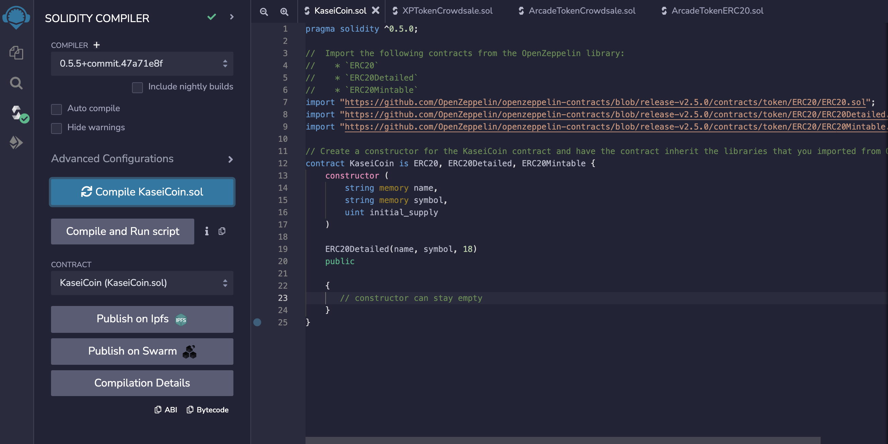
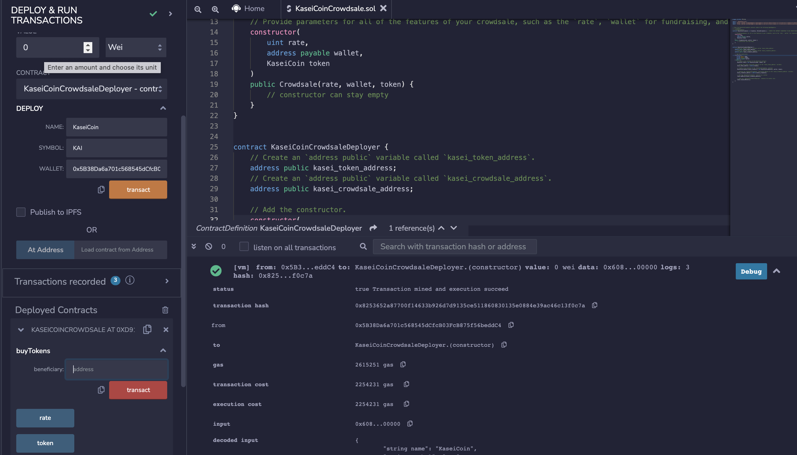

# Martian Token Crowdsale

## Background
After waiting for years and passing several tests, the Martian Aerospace Agency selected me to become part of the first human colony on Mars. As a prominent fintech professional, they chose me to lead a project developing a monetary system for the new Mars colony. I decided to base this new system on blockchain technology and to define a new cryptocurrency named KaseiCoin. (Kasei means Mars in Japanese.) 

KaseiCoin will be a fungible token that’s ERC-20 compliant. I'll launch a crowdsale that will allow people who are moving to Mars to convert their earthling money to KaseiCoin.

## Solidity Files
[KaseiCoin.sol](https://github.com/kyleplathe/Martian_Token_Crowdsale/blob/main/Contract/KaseiCoin.sol)  
[KaseiCoinCrowdsale.sol](https://github.com/kyleplathe/Martian_Token_Crowdsale/blob/main/Contract/KaseiCoinCrowdsale.sol)

## Step 1: Create the KaseiCoin Token Contract
Successfully compiled contract.

## Step 2: Create the KaseiCoin Crowdsale Contract
Successfully compiled contract.

## Step 3: Create the KaseiCoin Deployer Contract
Successfully compiled contract.

## Step 4: Deploy and Test the Crowdsale on a Local Blockchain

